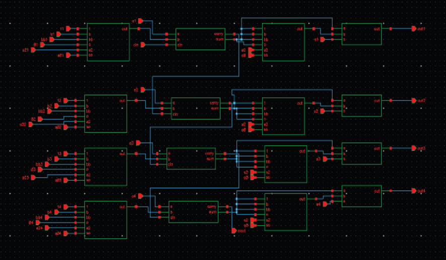

# ⚡ Low Power and Area-Efficient ALU (Verilog, FPGA)

## 📌 Overview
Designed and implemented a **1-bit, 8-function Arithmetic Logic Unit (ALU)** in Verilog HDL, optimized for **low power** and **minimal area**, and validated through **FPGA simulation**. Applies **advanced VLSI design techniques** to achieve high efficiency with compact hardware.

---

## 🔑 Key Highlights
- Arithmetic: ADD, SUB  
- Logic: AND, OR, NAND, NOR, XOR, XNOR  
- **99.998% power reduction** vs baseline design  
- **30% area savings** on silicon footprint  
- **148 ps speed** (ultra-fast operation)  
- Verified functionality on **FPGA hardware**  

---

## 🛠️ Tools & Technologies
- Verilog HDL, Xilinx ISE / Vivado, FPGA board  
- 45nm CMOS technology with GDI (Gate Diffusion Input)  

---

## 🔧 Schematic
  
*Fig. 1. Schematic diagram of the ALU using optimized full adders*

---

## 📊 Simulation Outputs
  
*Fig. 2. Produced output of 4-bit ALU using optimized techniques*

---

## ⚡ Power Analysis
  
*Fig. 3. Power consumption comparison of different ALU techniques*

---

## 🚀 Impact
- Demonstrates **ultra-low power VLSI design** for embedded/IoT applications  
- Architecture suitable for **mobile processors, IoT, and edge devices**  

---

👩‍💻 **Author:** Shreya Pandey (B.E. ECE, BMSCE)  
